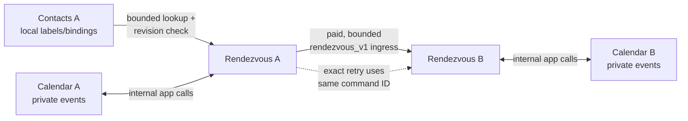

# Rendezvous submission runbook

This is the release checklist for the Neutron Hackathon entry. The app submitted to the portal is **Rendezvous**; Contacts and Calendar are its required installed dependencies and should be included in the repository, demo fleet, and reproduction instructions.

## Submission copy

**Title:** Rendezvous

**Summary:** Rendezvous finds a meeting time across two independently owned Neutron canisters without a scheduling server or shared calendar database. Each person's Calendar filters candidates locally; only bounded proposal state crosses a paid, caller-bound public-ingress route. Durable intents, exact retries, revision checks, local holds, and final Calendar revalidation make replay, lost replies, and mid-flight conflicts safe.

**Short pitch:** Private peer-to-peer scheduling for sovereign personal clouds.

**Package:** `apps/rendezvous/rendezvous.v0.2.1.neutron`

**Required companion packages:** `apps/contacts/contacts.v0.3.1.neutron`, then `apps/calendar/calendar.v0.2.0.neutron`

**Icon:** `apps/rendezvous/public/static/icon.png`

Suggested links:

1. Public source repository and tagged submission commit.
2. Demo video.
3. `DEMO.md` or a rendered architecture/threat-model page.

## Portal requirements to recheck before upload

The official [Neutron Hackathon](https://4576f-3aaaa-aaaam-ajgpq-cai.icp0.io/)
portal's current client bundle was audited on 2026-08-21. It requires a
`.neutron` package plus title, summary, icon, screenshots, and links; a Hacker
role; a reward wallet; and own-work/download consent.

Current upload limits, still subject to a final live-form check before upload:

- one package per app, at most 1.9 MB;
- icon at most 100 KB;
- up to six screenshots, each at most 400 KB;
- up to six links.

Each qualifier permits one submission per hacker. Entries and later versions are moderator-reviewed. The final hour of an open round freezes app-content revisions, so submit early enough for moderation. Use the live countdown in the portal as the authoritative deadline; do not copy a projected date into this repository.

The release artifacts fit those limits individually:

- Rendezvous package: 808,243 bytes;
- required Calendar package: 734,302 bytes;
- required Contacts package: 253,319 bytes;
- icon: 80,955 bytes.

## Architecture



There is no Rendezvous service canister, shared account system, or shared calendar database. Each app runs inside its owner's Neutron canister. Contact names, notes, existing event titles, event notes, and busy intervals never enter the peer protocol.

## Clean release verification

Run from the repository root in the pinned development environment. Prerequisites are Node/npm, Bun, and Mops; the official [getting-started guide](https://www.ntron.net/docs/develop/getting-started) recommends `nix develop` for the pinned tools.

```sh
npm install
npm --workspace neutron-calendar test
npm --workspace neutron-rendezvous test
MOTOKO_TEST=public_ingress_service_test.mo,backend_calls_test.mo npm --workspace neutron-kernel exec -- bun test/motoko/run.ts
npm run test:e2e:rendezvous:fresh
npm run test:e2e:calendar-upgrade:fresh
npm run test:e2e:submission-install:fresh
```

The fresh browser command destructively reinstalls the configured local Alice/Bob fleet, then runs smoke, happy-path, conflict-safety, and diagnostic-privacy coverage through local Internet Identity.

Last verified on 2026-08-21: the complete Rendezvous workspace suite passes,
including 17 frontend/package tests plus memory and Motoko protocol tests. The
exact final archives passed all 15 product scenarios in the destructive fresh
two-Neutron browser suite in 2.5 minutes; only the opt-in diagnostic case was
skipped. Coverage includes native drag/resize persistence and visible two-tab
stale-drag rollback. A separate kernel-only fixture reviewed and installed
Contacts 0.3.1, Calendar 0.2.0, and Rendezvous 0.2.1 in dependency order in
58.4 seconds and verified runtime versions 301/200/201.

Expected release artifacts and current SHA-256 values:

```text
19591c8db038db92c182b70ce0761e855efc1e7e7f37d3b1503866baa11d097a  apps/contacts/contacts.v0.3.1.neutron
9fce191e78effbe62588154e511faf2d9768dd50d40e04fd4787825941df5242  apps/calendar/calendar.v0.2.0.neutron
9058aa9a9132f3f8a55cc00b68d874c22413ddfa8de3bff8e5957582be86392c  apps/rendezvous/rendezvous.v0.2.1.neutron
```

Recompute after any source or package rebuild:

```sh
shasum -a 256 apps/contacts/contacts.v0.3.1.neutron apps/calendar/calendar.v0.2.0.neutron apps/rendezvous/rendezvous.v0.2.1.neutron
```

## Demo assets to capture

Capture real product screens from a fresh two-node run; do not use a mockup as proof of execution.

Capture the six verified states from an automatically cleaned fleet:

```sh
npm run submission:rendezvous:screenshots
```

This writes size-controlled JPEGs to `submission-assets/`.

1. Alice's sent proposal with delivered transport evidence.
2. Bob's received proposal with each option revalidated locally.
3. Alice's Calendar after confirmation.
4. Bob's Calendar after confirmation at the same time.
5. The confirmed meeting's read-only Calendar detail view.
6. The matching confirmed negotiation highlighted after cross-app navigation.

Crop or resize every final image below 400 KB and verify no local paths, private principals beyond the intentional demo identities, passkey dialogs, or diagnostic data are visible. Use the two-minute narration in `DEMO.md` for the video.

## Portal submission procedure

1. Open the official hackathon site and sign in with Internet Identity.
2. In Profile, enable Hacker, accept the participation agreement and own-work/download consent, and set the intended reward wallet.
3. Open **Profile → Entries** during an open qualifier.
4. Add the title, summary, icon, screenshots, and public links.
5. Upload `apps/rendezvous/rendezvous.v0.2.1.neutron` as the app package.
6. Submit for review and confirm the entry becomes approved before the live round's final-hour freeze.
7. From a separate clean Neutron, download/install through the reviewed browser flow. Install Contacts first, Calendar second, and Rendezvous last; confirm the displayed capability requests match this document.
8. Preserve the submitted commit, package hashes, screenshots, video URL, and portal entry URL in the release notes or Git tag.

## Judge-facing proof points

- Two owners, two canisters, no central backend.
- Calendar remains the private scheduling authority; Rendezvous receives only filtered candidate results.
- Remote mutation uses Neutron's declared public ingress and the initiator pays the fixed cycle floor.
- Invite capability and exact caller binding establish the peer relationship; cycles are not identity.
- Exact command receipts make retries idempotent, while timeout is shown as uncertain rather than false success.
- Calendar holds and final revalidation prevent double-booking when local state changes mid-flight.
- Malformed/oversized payloads, replay/reorder, wrong caller/capability, underfunding, revocation, and privacy diagnostics have automated evidence.

## Known limitations

Version 0.2.1 uses Contacts as its primary peer picker. Rendezvous searches only
bounded Contact metadata and immediately revalidates the exact Contact ID,
contact revision, book revision, and Neutron principal before creating an
offer; stale/rebound Contacts fail closed. Contact names and notes never enter
the peer protocol. A reusable `RVC1` sharing address remains the fallback and
contains only the Neutron principal; it is deliberately distinct from the
private random capability generated for each negotiation.
Rendezvous v1 represents an ordered set of equal candidate times; the current
counter flow proposes one exact alternative, so preference ranking and
multi-option counters require a future protocol revision. Calendar supports
bounded local recurrence but does not yet sync external calendars or send email
notifications. Browser meetings use a reviewed Kernel-brokered, revocable
nonce-origin surface; ordinary app tiles remain denied camera and microphone.
The current WebRTC experiment has no STUN/TURN or relay fallback, so claim only
direct connectivity where host candidates are mutually reachable. There is no
human-identity claim. Neutron itself is
preproduction; describe this as a hackathon demonstration, not a production
scheduling service.

Upgrade safety is exercised against the released predecessor, not only a
memory-unit fixture: `npm run test:e2e:calendar-upgrade:fresh` installs Calendar
v0.1.0 on a dedicated local Neutron, creates an event through the old tile,
reviews and applies v0.2.0 through Neutron's package-update UI, and verifies the
event remains present with memory schema 2.

The clean owner-install fixture, `npm run test:e2e:submission-install:fresh`,
starts with a kernel-only Neutron and drives the reviewed browser File flow for
Contacts, Calendar, then Rendezvous. It waits for every browser compile and
checked upgrade, opens all three apps, and verifies versions 301/200/201.

## Final human checklist

- [x] All automated commands above pass on the final submission candidate.
- [x] Recomputed release hashes match the recorded files.
- [ ] Repository/tag is public and its license/NOTICE files are present.
- [x] Six real 0.2.1 screenshots use the Contacts-first primary flow and are
  under 80 KB each (`submission-assets/`).
- [ ] Demo video link works without authentication.
- [ ] Hacker role, consent, and reward wallet are configured.
- [ ] Portal entry is submitted and moderator-approved before the freeze.
- [x] Clean reviewed browser File install works: Contacts, Calendar, Rendezvous.
