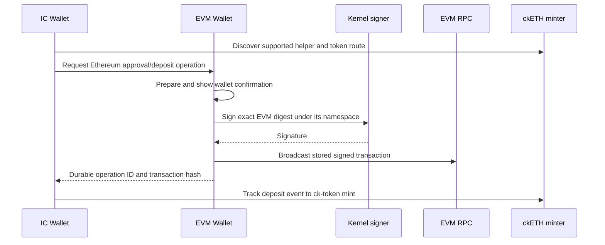

# Separate EVM Wallet: Research And Proposed Design

Research date: 2026-09-05. This document preserves the initial design research;
its proposals and component inventory describe that stage of development. See
the [implementation guide](./evm-wallet.md) for the implemented contract and the
checklist below for qualification status.

The custody lifecycle uses stable app-ID derivation in Kernel 346. Upgrading
from Kernel 344 starts a fresh Wallet account while retaining Kernel memory v4;
see the [fresh-start checklist](./todo.wallet-fresh-start.md).

Implementation checklist: [EVM Wallet and app integrations TODO](./todo.evm-wallet.md),
including IC Wallet fixes, Kitchen Sink examples, and a separate Uniswap app.

## Recommendation

Create `apps/evm_wallet` as a separate ordinary Neutron app. It owns EVM
accounts, networks, balances, signing requests, transaction preparation,
broadcast, and history. The existing IC Wallet remains `apps/wallet` and uses
EVM Wallet's public tools for the Ethereum side of ck-token deposits. Uniswap,
Curve, and other apps use the same tools.

Use IC threshold ECDSA for a normal externally owned account (EOA), and the IC
EVM RPC canister as the default network transport. Start with Ethereum and
Arbitrum, with an explicit per-network configuration model that can support
more EVM networks. Treat portfolio indexing and enhanced simulation as
replaceable integrations.

Keep protocol semantics in the app. Kernel supplies isolated signing authority,
authenticated app routing, existing provider presentation, and existing remote
canister calls. A new signing grant is required; a new general permission system
or a Kernel implementation of Uniswap is not.

## What Neutron Already Has

| Existing component | What can be reused | What it does not supply |
| --- | --- | --- |
| App-isolated chain-key signing | AppScope binding, key derivation, key configuration, management-call transport, disable/revocation, cycle accounting | Ethereum-compatible signing: current messages are Neutron assertions |
| Provider-owned `provider_once` tools | One confirmation in the exact provider app's tile, authenticated original caller | EVM transaction decoding, simulation, or durable transaction state |
| Private `agent_root` tools | Direct root automation through the same provider backend | Automatic authority for nested applications or unattended background spending |
| `backend_calls` | Reserved calls to the EVM RPC canister with cycles | EVM transaction encoding and RPC-specific response handling |
| Managed app memory | Durable account, nonce, request, and receipt records | Automatic recovery from an ambiguous external transaction |
| Existing IC Wallet Ethereum code | Helper discovery, principal encoding, allowance and ck-token deposit logic | A Neutron-controlled EVM private key or account |

Relevant local contracts: [product model](./product-model-and-user-story.md),
[chain-key signing](./app-isolated-chain-key-signing.md),
[provider and Agent consent](./app-method-access-and-call-consent.md),
[backend dependencies](./backend-app-dependencies.md), and
[IC Wallet](../apps/wallet/README.md).

## Namespaces And Exclusive Signing

Kernel 346 derives custody namespace v2 from the Neutron canister, app ID,
slot, algorithm and trusted key name. The installation UID and Kernel epoch
are not inputs. This lets a fresh installation of the same app ID and slot
recover the same key. The exact encoding is in the
[custody signing contract](./app-isolated-chain-key-signing.md#wallet-custody-signing-v1)
and [namespace implementation](../apps/kernel/backend/chain_key_signing/Namespace.mo).

The current `AppScope` controls access. A scoped handle cannot select another
app's identity or an arbitrary management derivation path. Slot removal,
uninstall, disablement and stale/in-flight handle checks retain their existing
revocation behavior. Reinstallation receives access through the ordinary
explicit custody grant. Only grant access to trusted packages: a replacement
using the same app ID and slot can control the same account. Uniswap and IC
Wallet use EVM Wallet's tools, never its backend signing capability.

| Event | Custody behavior with Kernel 346 |
| --- | --- |
| Compatible app update retaining app ID, slot, algorithm and key configuration | Same key |
| Disable/re-enable unchanged capability | Signing unavailable while disabled; same key afterwards |
| Another app declares the same local slot name | Different key |
| Remove and restore the same slot | Same key; signing requires the declared capability |
| App uninstall/reinstall with the same app ID and slot | Same key after the custody grant; deleted local data is not restored |
| Different canister, slot, algorithm or key configuration | Different key |

Upgrading from Kernel 344 starts a different Wallet account. Fully uninstall
EVM Wallet first, complete that transaction, upgrade Kernel to 346, and install
Wallet 119 afresh. Kernel retains its v4 memory root without a migration;
Wallet initializes its existing v1 roots blank. Assets, positions and permissions
at the old address do not move. Assertion-signing keys remain unchanged.

Uninstall deletes local wallet settings, history and request journals. Whole
Neutron reinstallation is outside the app-reinstall contract. Recovery into
another canister is not provided: IC signing derivation includes the signing
canister identity. The threshold-signing API provides no seed phrase or
private-key export.
[IC management API](https://docs.internetcomputer.org/references/management-canister/#chain-key-signing)

## The Necessary Signing Extension

Current `sign_assertion` signs a Kernel-created, domain-separated SHA-256 digest.
Ethereum needs its own exact signing digest. Passing an Ethereum hash as an
assertion would sign a different message and would not produce a valid EVM
transaction signature.

Recommended proposed interface: a new, explicitly reviewed wallet-custody
capability, separate from the existing assertion capability:

```text
public_key(slot) -> compressed secp256k1 public key + identity metadata
sign_digest(slot, digest32) -> raw r || s signature + closed outcome
```

These are backend capability operations, not public cross-app tools. Kernel
chooses the production key and constructs the namespace; app code supplies
neither an AppScope nor a master-key name nor an arbitrary derivation path.
Use a distinct key-derivation domain for the new authority and preserve every
existing assertion key and API. Sign the supplied EVM digest unchanged; do not
prefix or re-hash it with a Neutron message domain. A slot can initially represent one account;
additional accounts need a deliberate stable account-identifier scheme.

The EVM Wallet backend validates the request, constructs the exact EVM digest,
and calls this capability after its own human decision or the existing attested
root-Agent flow. It owns operation IDs and durable replay handling. Kernel
continues to enforce source binding, declaration, enablement, and revocation,
including checks around asynchronous management calls.

**This is an explicit proposed extension to the trust contract.** The current
[assertion design](./app-isolated-chain-key-signing.md) reserves future raw
transaction signing for typed Kernel adapters and transaction-shaped owner
review; it does not already authorize a Wallet raw signer. Choosing the proposed
custody model means documenting that the owner trusts this installed wallet's
signing behavior, as they already trust the IC Wallet's transfer behavior.
It cannot protect the wallet's funds from a malicious wallet package itself.
Ordinary assertion grants must never acquire this authority implicitly.

The alternative is a typed EVM signer inside Kernel that independently parses
transactions/messages, computes their digests, and binds approval to those
contents. That preserves the stricter proposed Kernel boundary, but adds EVM
protocol implementation and consent machinery to Kernel. For Neutron's ordinary
provider-app model, the separate explicit custody grant is the better fit.

The change touches the capability catalog/normalizer, shared Motoko leaf types,
compiler projection, Kernel signing service and runtime lifecycle, permission
disclosure, and tests. Installation-scoped request identity also needs the small
caller-provenance extension described below. Reuse existing mechanisms rather than introducing an
`evm_wallet` special case. Any newly needed resource bounds must be measured and
their behavior agreed under `AGENTS.md`, not invented as extra wallet policy.

## Wallet Core And Persistence

Put authoritative preparation and execution in the Motoko backend. Frontend
state is a view of durable records, so closing a tile does not erase a submitted
transaction. Use viem for the app's TypeScript ABI/provider integration and
independent test vectors; a JavaScript dependency does not itself implement the
Motoko signing path. Validate any Motoko Keccak/RLP/secp256k1 implementation
against known vectors and an independent EVM client before funding accounts.
[Viem custom accounts](https://viem.sh/docs/accounts/local/toAccount)

Required account/protocol work:

- Derive the EVM address from the uncompressed secp256k1 coordinates using
  Keccak-256. Determine signature recovery parity from the known public key and
  normalize low-S correctly. IC provides raw `r || s`, not Ethereum's recovery
  byte. [IC Ethereum guide](https://docs.internetcomputer.org/guides/chain-fusion/ethereum/),
  [EIP-2](https://eips.ethereum.org/EIPS/eip-2)
- Support EIP-1559 transactions and chain-protected legacy transactions, with
  access-list support where applicable. Encode the chain ID in each signing
  payload. [EIP-1559](https://eips.ethereum.org/EIPS/eip-1559),
  [EIP-155](https://eips.ethereum.org/EIPS/eip-155)
- Implement personal-message signing and structured EIP-712 signing. Decode
  permits as spending authority, including token, spender, amount, nonce,
  deadline, and domain when those fields exist. Do not invent chain binding
  for a message format that lacks it. The initial public API need not expose
  arbitrary digest signing. [EIP-191](https://eips.ethereum.org/EIPS/eip-191),
  [EIP-712](https://eips.ethereum.org/EIPS/eip-712)
- Store asset identity as `(chainId, contractAddress)`, with native currency
  represented separately. The same address or token symbol on two chains does
  not identify the same balance. Key nonce and pending-transaction state by
  `(accountId, chainId)`.
- Freeze transaction fields and the reviewed fee envelope before signing.
  A changed destination, calldata, value, or fee authorization creates a revised
  decision. Display both expected fees and the authorized maximum appropriately
  for the chain.

Use a durable operation state machine:

```text
prepared -> authorized -> signing -> signed -> submitted
                                             -> mined success / mined revert
                                             -> finalized
```

Also represent cancellation before signing, unknown outcomes, replacement,
and signature release without wallet broadcast. An emitted signature is usable
authority even if the tile closes or a subsequent step is canceled.

Key idempotency by authenticated calling AppScope plus request ID. Current
`context.caller` exposes app ID and endpoint/session information, but not the
installation UID. This proposal therefore includes an additive Kernel/SDK
caller-provenance field derived from the registered endpoint's AppScope and
forwarded through provider and root dispatch. Never trust an installation UID
from caller-authored arguments. Keep old callers/providers compatible; the new
wallet requires the new provenance when creating these commands. See
[caller construction](../apps/kernel/src/expose.ts) and
[protocol types](../packages/neutron-tools/src/protocol.ts).

An identical replay returns the same operation; changed intent under that ID
conflicts. Endpoint replacement should not create a fresh transaction identity.
Persist exact unsigned fields and nonce allocation before awaits; persist
signed bytes and their locally computed transaction hash before broadcast.
After a lost broadcast response, query that hash and, if needed, rebroadcast
the same bytes. Never interpret a timeout as evidence that a new transfer is
safe. Unknown signing outcomes also remain explicit; do not automatically
regenerate or release a new authorization.

Serialize nonce allocation for the same account and chain in the backend, so
two apps or two tiles cannot both choose the same nonce. Reads and independent
chains can run concurrently. Model speed-up/cancel as explicit same-nonce
replacement requests, with no promise that cancellation beats the original.

Use chain adapters for fee estimation and finality. Arbitrum's
`eth_estimateGas` includes its parent-chain posting component; do not add that
component twice. A sequencer receipt, L1 settlement, and an L2-to-L1 withdrawal
challenge period are distinct. [Arbitrum gas](https://docs.arbitrum.io/arbitrum-essentials/how-to-estimate-gas),
[Arbitrum finality](https://docs.arbitrum.io/how-arbitrum-works/deep-dives/finality)

## RPC, Portfolio Data, And Simulation

| Need | Recommended integration | Important qualification |
| --- | --- | --- |
| Balances, contract reads, gas, nonces, broadcast, receipts | IC EVM RPC canister | Multi-provider agreement is not an Ethereum light-client proof |
| Token discovery and richer portfolio/history | Optional Alchemy data adapter | Indexed/provider claims; retain chain, freshness, pagination, and partial errors |
| Enhanced transaction and bundle simulation | Optional Tenderly adapter | Simulation predicts execution at a particular state; it cannot guarantee the eventual result |

EVM RPC's built-in networks include Ethereum, Sepolia, Arbitrum One, Base, and
Optimism; custom RPC services can support other EVM chains. Built-in providers
do not require the wallet owner to supply an API key. Use existing Neutron
`backend_calls` reservations for its exact Candid methods and cycle attachment.
[Supported networks](https://docs.internetcomputer.org/guides/chain-fusion/ethereum/#supported-chains-and-providers)

Pin a released interface and verify production support during implementation.
The tagged `evm_rpc-v2.8.0` Candid includes typed read/send methods and
`multi_request`/`multi_requestCyclesCost` for other JSON-RPC requests. Its older
`request` is single-provider and deprecated; do not copy that example and claim
provider consensus. Some documentation/changelog naming differs from released
Candid, and main-branch batch APIs are not in that tag. This research did not
independently attest the production canister's deployed module.
[Released Candid](https://raw.githubusercontent.com/dfinity/evm-rpc-canister/evm_rpc-v2.8.0/candid/evm_rpc.did)

Neutron's local fixtures already pin this EVM RPC release:
[local_chain_fixtures.ts](../packages/neutron-provision/src/local_chain_fixtures.ts).
Use that existing test infrastructure. Estimate cycle costs rather than fixing
a dollar amount in wallet logic. IC signing/RPC consumes Neutron cycles;
Ethereum/Arbitrum transactions separately require native gas currency on their
respective networks. [IC cycle costs](https://docs.internetcomputer.org/references/cycle-costs/)

Handle `Consistent(Ok)`, `Consistent(Err)`, and `Inconsistent` distinctly.
Choose coherent block references where possible; live `pending`/`latest`
responses can disagree. RPC fallback must not silently change the network or
turn disagreement into a successful financial result. The exact provider
agreement choice is an app configuration/reliability decision, not a new
Kernel policy.

Standard RPC covers native balances and selected ERC20 `balanceOf` reads, but
complete token discovery/history generally needs indexing. Alchemy's Portfolio
API returns balances and metadata across networks; its response can contain
partial failures even with HTTP 200. Treat a failed network as unavailable, not
zero balance. [Alchemy Portfolio API](https://www.alchemy.com/docs/data/portfolio-apis/portfolio-api-endpoints/portfolio-api-endpoints/get-token-balances-by-address)

Begin simulation with `eth_call`/`eth_estimateGas`; add richer changes/traces
through a dedicated adapter if useful. Tenderly offers transaction/bundle
simulation. Avoid a new dependency on Alchemy's old Transaction Simulation API:
its docs announce deprecation on September 30, 2026.
[Tenderly simulation](https://docs.tenderly.co/simulations/overview),
[Alchemy deprecation](https://www.alchemy.com/docs/reference/simulation-faqs)

Existing Neutron `https_outcalls` deliberately uses one replica and provides
neither response consensus nor private credential injection. Do not put a
provider secret into package manifests or assume backend state is confidential
from replicas. Keyless EVM RPC avoids this blocker for the core wallet.
Optional paid indexer/simulation integration needs a separately designed
credential/proxy path; ordinary authenticated HTTPS is not confidential canister
computation. See [HTTPS guidance](./app-developer-guide.md#use-https-outcalls-development-v1).

## Cross-App Contract

Expose versioned, closed-schema resident tools. Proposed names:

| Tool | Behavior |
| --- | --- |
| `evm_accounts_v1`, `evm_networks_v1` | Read wallet accounts and supported/configured networks |
| `evm_balances_v1`, `evm_read_contract_v1` | Read exact assets or contract state with freshness/source evidence |
| `evm_send_transaction_v1` | Present the EVM Wallet decision and sign/broadcast one operation |
| `evm_sign_message_v1` | Present a personal-message signing decision |
| `evm_sign_typed_data_v1` | Present an EIP-712 signing decision |
| `evm_operation_status_v1` | Resume/inspect a durable request, transaction, or replacement |

Human effect tools use `provider_once` and a private `foreground_tile`
presentation tool, matching the IC Wallet. Wallet receives original caller
provenance from Kernel, not from caller-authored JSON. Backend calls issued
inside handlers use `context.kernel` to preserve cancellation and invocation
scope. A separate `agent_root` tool family may drive the same checked core
without human UI when the current root is attested.

For an autonomous Uniswap flow, the root gets the route/quote from the Uniswap
app, then calls EVM Wallet's root tool directly. A nested Uniswap-to-wallet call
does not become a root call. Human Uniswap-to-wallet requests use the public
presentation route. This uses the current authority model without widening
delegation.

An EIP-1193 adapter in the app SDK can translate standard `request()` calls into
these tools for future Uniswap/Curve app integrations. Keep explicit `chainId`
in the internal contract so concurrent apps do not race a global selected-chain
setting. Support account/chain events if exposing a complete provider facade.
Neutron's existing `ethereum_provider` connects external browser wallets; the
internal EVM wallet does not need to masquerade as one.
[EIP-1193](https://eips.ethereum.org/EIPS/eip-1193)

Broad Uniswap integration should support onchain calls and permit signatures;
the required flow depends on the router and route. Permit2 has
its own allowance and signature paths and still requires the underlying token
approval. Decode the actual token, spender, amount, and expiry rather than
showing only “sign a message.” Do not treat a caller-supplied ABI or swap label
as authoritative proof of what arbitrary calldata does.
[Permit2](https://developers.uniswap.org/docs/protocols/permit2/overview)

Keep permit-specific nonce domains separate from EVM transaction nonces.
Permit2's allowance and signature-transfer modes also have different nonce
schemes; they must not share a guessed sequential counter.

For approval followed by swap/deposit, maintain a resumable sequence with
separate receipts and a clearly presented set of steps. An EOA sequence is not
automatically atomic. Later `wallet_sendCalls` support must accurately advertise
its capabilities, particularly atomicity.
[EIP-5792](https://eips.ethereum.org/EIPS/eip-5792)

## IC Wallet Integration



IC Wallet retains helper discovery, token-to-ledger mapping, IC destination
principal/subaccount, and mint tracking. EVM Wallet owns the Ethereum account,
nonce, fees, signatures, and transaction receipts. Reuse the existing helper
code/allowance validation as protocol logic; replace its external-provider
transport with the EVM Wallet adapter when that source is selected.

Current production ckETH/ckERC20 deposits are on Ethereum mainnet. Arbitrum USDC
cannot be deposited directly into Ethereum's ckUSDC helper. Supporting that
source requires a separate cross-chain transfer first. Deposits call the helper
contract, not an ordinary transfer to the minter. Check current token support
before preparing the call. Redemptions remain minter operations initiated by IC
Wallet and may use the EVM Wallet address as destination.
[ckERC20 reference](https://github.com/dfinity/ic/blob/master/rs/ethereum/cketh/docs/ckerc20.adoc)

ckERC20 redemption also needs ckETH and its separate minter allowance for
Ethereum gas, in addition to the ckERC20 allowance. That withdrawal gas is not
charged to the receiving EVM Wallet's ETH balance.

Keep the released `wallet_fund_v1` ICRC contract unchanged. Add a dedicated
managed bridge-operation root if IC Wallet needs durable cross-wallet workflow
state; retain released `wallet` v1 and `wallet_commands` v1 sources. Contacts
currently represents Ethereum mainnet only, so multi-chain contact support is
a separate compatible schema/API extension; explicit EVM address inputs can
work first.

## Demonstrated Existing Gaps Relevant To The Integration

These are source findings, not claims of observed production fund loss:

1. [IC Wallet deposit UI](../apps/wallet/src/index.tsx) marks a pending deposit
   minted when any ck-token balance increase is observed (`3740–3744` at the
   inspected revision). An unrelated transfer can satisfy that check. Track
   the deposit transaction/event and associated minter result instead.
2. The same component stores transaction hash and phase only in React state
   (`3720–3724`). Receipt timeout clears the active phase and enables submission
   again (`3801–3806`), while
   [receipt polling](../apps/wallet/src/ethereum.ts) reports that a transaction
   may still be pending. Persist and resume the original operation.
3. The older [IC send path](../apps/wallet/backend/main.mo) creates a new transfer
   timestamp per invocation and flattens unknown outcomes into ordinary errors;
   [native withdrawals](../apps/wallet/backend/chainkey/Withdrawals.mo) also lack
   a durable command key in those paths. Reuse the newer funding journal's
   intent/replay design for new cross-wallet workflows rather than copying
   those older retry semantics.

## Implementation Order And Release Evidence

1. Define the custody grant and app-ID account lifecycle, including the fresh
   account required when upgrading from Kernel 344.
2. Add the isolated signing extension and test key retention, cross-app
   isolation, revoked/stale handles, and actual EVM signature vectors.
3. Build EVM Wallet's durable backend and Ethereum/Sepolia flows: address,
   balance, native/ERC20 transfers, arbitrary contract calls, receipts, and
   ambiguous-outcome recovery. Add Arbitrum with chain-specific fee/finality
   tests and explicit network handling.
4. Add provider UI, public transaction/message tools, root tools, and a small
   test caller app. Test two simultaneous callers, cancellation during each
   phase, tile replacement, and spoofed caller/chain/request fields.
5. Add EIP-712/Permit2 and exercise one real swap integration on test/fork
   infrastructure. Test approval-plus-call partial completion and signature-only
   authority release.
6. Connect IC Wallet deposits and redemptions. Test mint correlation, pending
   resumption across reload/upgrade, and preservation of existing IC state.
7. Add optional discovery/history/simulation integrations as separately
   configured services. Defer WalletConnect, smart accounts, gas sponsorship,
   EIP-7702, and broad NFT management until their product behavior is specified.

Use immutable managed-memory schemas and forward migration paths, including
skipped production upgrades. Existing Kernel schema changes require a successor
schema; a code-only change must not invent a fake migration. Package and run
release tests for each changed app. Publish compatible Kernel/app successors
atomically and repeat the exact publication to verify the required receipt-v2
no-op, following [package updates](./package-updates.md). A new app uses the
repository's default `LICENSE.APP.USE` packaging workflow.

No production signatures, transfers, package builds, or publication were
performed for this research.
