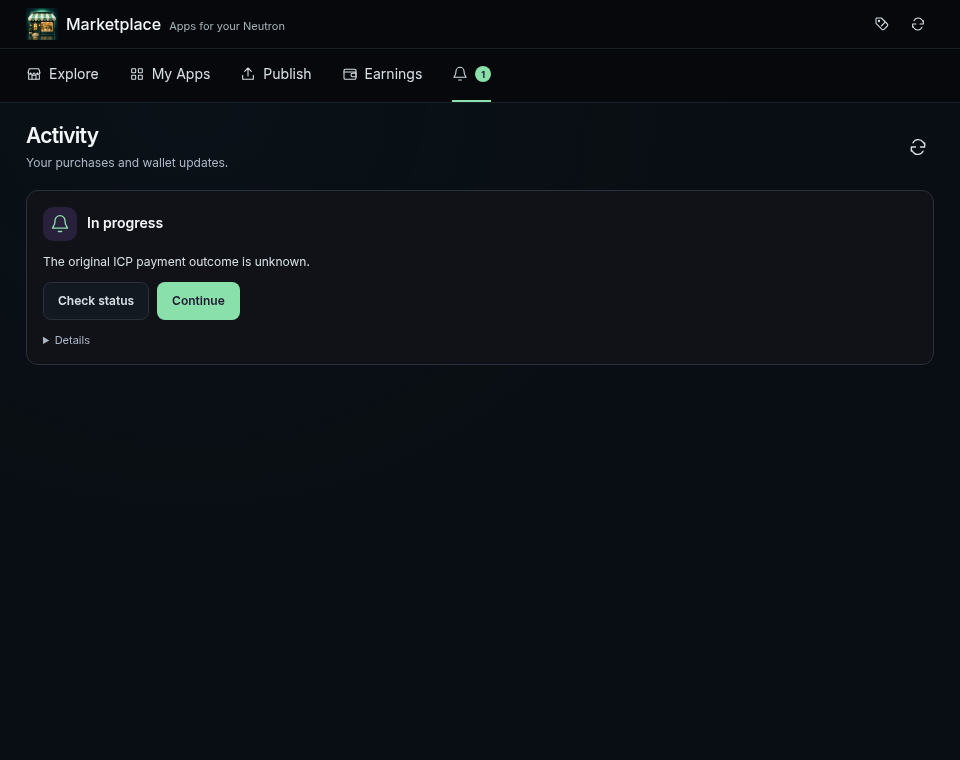
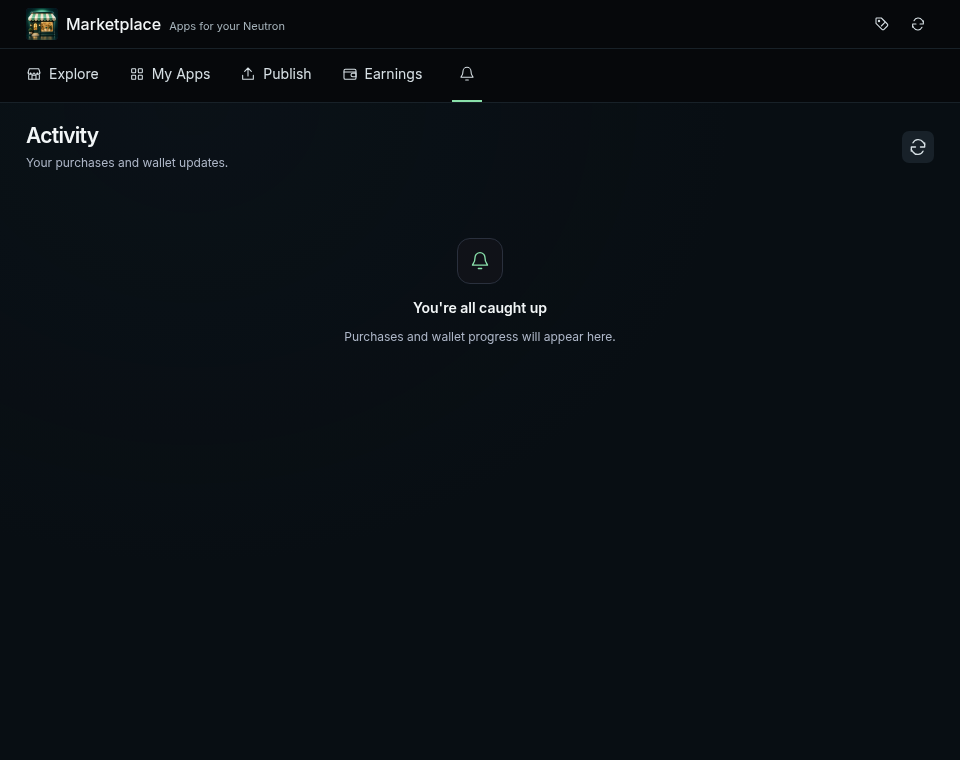

# Permanent Marketplace notification dismissal

Marketplace **0.1.24** makes X delete the selected checkout's saved intent,
approval/deposit journals and revision history from the Neutron. It no longer
stores browser dismissal preferences. The backend compares the current records
with the reviewed snapshot before removing them together; a payment beginning
during dismissal prevents deletion.

Approval-only checkouts are clearable, including confirmed ledger/Ethereum
approvals, legacy drafts and stuck free acquisitions. Submitted or uncertain
payments and unfinished settlement retain recovery. A fresh status check runs
before deletion. Late approval callbacks and suspended continuations cannot
recreate a dismissed checkout or start its deposit.

Protocol ownership and financial accounting remain durable. Activity imports
historical operations only when they contain unfinished payment recovery;
completed or unfunded history cannot recreate a cleared notification.

The [package audit](package-audit.json) verifies the exact 0.1.24 archive and
unchanged memory schemas, migration, lock lineage, capabilities and dependencies.
The existing state root remains at version 2. The two added backend methods
provide atomic deletion and payment-step creation tied to an existing checkout.

[Release checks](release-checks.json) passed the complete workspace package,
app tests and Motoko backend tests, typecheck, all nine browser suites, and
actual client/protocol integration. Checked upgrades from released Marketplace
[112](upgrade-112.json), [118](upgrade-118.json), [121](upgrade-121.json),
[122](upgrade-122.json) and [123](upgrade-123.json) preserve the complete saved
state and identity, exercise deletion through the generated backend ABI, and
verify clean initialization. No protocol or Kernel change is needed for this
follow-up release.

The [Playwright results](browser-results.json) cover failed deletion, stale
reads, actual removal from the simulated Neutron store, and reopening in an
entirely fresh browser context. Screenshots use the actual UI with disposable
local fixtures; production user purchases and installed state were untouched.

| After clearing approvals and completed activity | Empty activity view |
|---|---|
|  |  |

The acquisition and Settings fixes already in this PR retain their
[original release evidence](../installed-acquisition/README.md).

Marketplace **0.1.24** was [published to beta](beta-publish.json) in batch **24**
through root `npm run updates:publish`. The [repeat against the same bytes](beta-repeat.json)
returned `batch_id: null`; every one of the 28 selected packages and offered
sources was `unchanged`. [Postflight verification](publication-verification.json)
compares all versions, URLs, paths, sizes and SHA-256 values with the frozen
reviewed artifacts. Kernel remains at its previously published 0.3.63.
