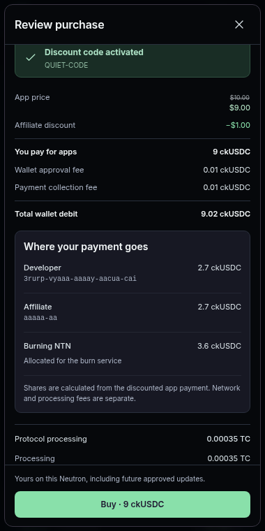

# Marketplace notification permissions and TC costs

Marketplace **0.1.25** fixes the notification X error, “Method is not preapproved
for this app”. Version 0.1.24 exported `marketplace_delete_operation` and
`marketplace_save_draft_child` but omitted them from `preapproved_self_calls`.
This release declares both exact methods as owner-authorized updates. The
Kernel permission check and existing payment recovery rules are unchanged.

The regression tests call the actual Marketplace store adapter through the
Kernel permission check. They reproduce both rejections with the frozen 0.1.24
package and allow both calls with the successor declaration. Upgrade checks
also load each installed registry from the test canister, match its capability
fingerprint against the runtime, and pass app calls through the real permission
check before invoking the generated backend ABI. Earlier notification tests
used a client mock or direct owner calls, which missed this permission error.

All Marketplace cycle amounts now display in **TC**, rounded to at most two
significant digits. `351,285,000 cycles` becomes `0.00035 TC`. A shared formatter
covers totals, processing, storage and installation costs across checkout,
publishing, withdrawals and agent reviews. Integer arithmetic avoids floating
point rounding errors; quotes and charged amounts retain their exact values.

The [package audit](package-audit.json) verifies both new declarations and all
50 unchanged backend/lock files. The sole managed memory root remains version 2;
released schemas, migration modules and lock lineage are byte-for-byte intact.

[Browser results](browser-results.json) include TC rendering and permanent
notification deletion with local fixtures. This screenshot shows the actual
Marketplace checkout at 380px:

[Release checks](release-checks.json) passed packaging, 175 app tests plus
Motoko backend tests, typecheck, 35 Kernel self-call tests, all nine browser
suites, and actual client/protocol integration. [Installation browser checks](browser-install-results.json)
verify that rounded TC labels still dispatch the exact original cycle amounts;
[Ethereum checks](browser-ethereum-results.json) cover preparation and verification costs.

All six checked upgrades passed, from released Marketplace
[112](upgrade-112.json), [118](upgrade-118.json), [121](upgrade-121.json),
[122](upgrade-122.json), [123](upgrade-123.json) and [124](upgrade-124.json).
Each verifies clean initialization, retained complete state and identity,
payment/install journal bytes and history, and authorized deletion after the
upgrade. The 124 receipt also records reproduction of both permission failures
before the upgrade. These checks use disposable PocketIC canisters; production
user installations are not modified by this release workflow.

Marketplace **0.1.25** was [published to beta](beta-publish.json) in batch **25**
through root `npm run updates:publish`. The [second run against the same bytes](beta-repeat.json)
returned `batch_id: null`, with all 28 packages and offered sources `unchanged`.
[Postflight verification](publication-verification.json) compares every version,
URL, path, size and SHA-256 with the frozen reviewed artifacts. Marketplace is
the only changed package. Kernel remains at its published 0.3.63; production
user canisters and Dispenser starter selection are unchanged.
