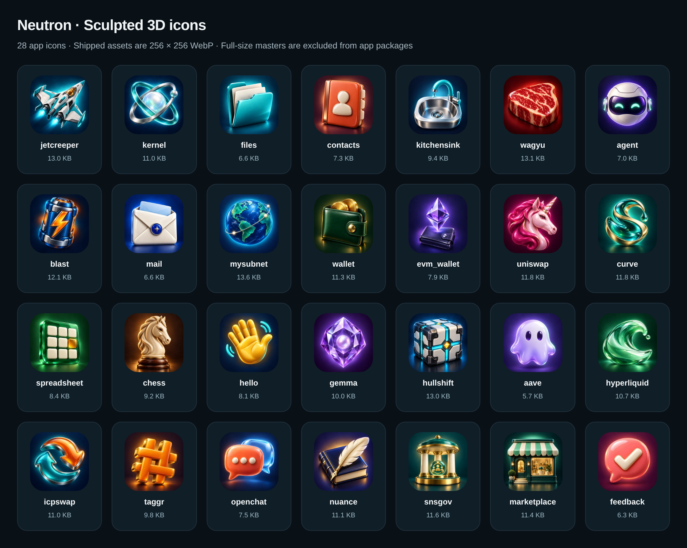

# Marketplace storefront and icon release evidence

The storefront has admin-editable categories, app tags, short promotional titles
and subtitles, and an ordered featured selection. Wide tiles use a left category
sidebar; smaller tiles use a horizontal row. Two featured apps use large covers
with a CSS glass fade. Each paid/free chart has four medium leaders and compact
cards for the rest. Cards display app names and tags; publisher links remain in
app details.

All 28 listing icons use the selected sculpted 3D bitmap style. Shipped icons are
256 × 256 WebP, 5,846–13,908 bytes each, 282,864 bytes total. Launcher icons use
the identical bytes. Full-size generated PNG masters are excluded from app
packages. Kernel has no launcher; headless Blast receives a new package so its
beta listing snapshots the new icon. [Icon sizes and hashes](icons.json) and the
[built-in image-generation prompts](../../catalog/icon-prompts.json) identify
every asset. Sixteen 1672 × 941 WebP promotional covers accompany the existing
UI screenshots; [cover prompts](../../catalog/cover-prompts.json) are retained.



## Playwright screenshots

The screenshots render the actual Marketplace app inside its iframe sandbox at
device pixel ratio 2. The primary screenshots use a read-only snapshot of the
published beta catalog, including real prices, chart order and acquisition
counts. Images are served locally from bytes matching their published hashes.
They demonstrate the app rendered with production data; they do not claim a
production Neutron was upgraded or that a purchase was performed.

| Screenshot | Tile size | View |
|---|---|---|
| [Desktop](desktop.png) | 1422 × 1106 | Featured pair, four paid leaders and the compact remainder |
| [Wide sidebar](sidebar.png) | 1800 × 1106 | Categories on the left |
| [Mobile](mobile.png) | 390 × 900 | Scrollable category row and stacked featured cards |
| [Free apps](free-apps.png) | 1422 × 1106 | Free chart with medium and compact cards |
| [Illustrative chart](illustrative-desktop.png) | 1422 × 1106 | Larger paid fixture demonstrating compact paid cards and paging |

The illustrative chart deliberately uses example prices/counts. Production
prices were preserved. [Browser results](browser-results.json) and
[catalog snapshot](public-storefront.json) describe the primary screenshots.

```sh
# Responsive and interaction tests with illustrative chart data:
node apps/marketplace/test/browser/storefront.mjs

# Reproduce the primary screenshots with the saved production snapshot:
MARKETPLACE_STOREFRONT_SNAPSHOT=support/marketplace/evidence/storefront/public-storefront.json \
MARKETPLACE_STOREFRONT_ARTIFACTS=tmp/marketplace-storefront/production-screenshots \
node apps/marketplace/test/browser/storefront.mjs
```

`CHROMIUM_PATH` selects Chrome. Both modes also capture 320px and 960px layouts.

## Package and memory qualification

The [package audit](icon-package-audit.json) binds all 27 changed packages to the
certified stable/beta predecessor archives. It checks all 36 managed roots and
70 schema/migration/lock files, exact schema dependency closures, clean memory
plans and retained-root plans. Released schema history and app backend source
are unchanged. Repacking some apps includes the workspace's existing additional
`owns_principal` capability type member; all runtime bodies remain unchanged.
Marketplace retains its already published release-119 backend and capabilities.
Older historical schemas supported by each app are covered by its release tests;
Wagyu's oldest production state is schema 3.

[Release checks](release-checks.json) record the complete workspace package and
app test commands, including separate browser/protocol/release gates. Tests were
updated for current version/icon expectations, the existing backend capability
type, and Wallet's existing `wallet_read_v1` fixture contract. Wallet's isolated
PocketIC request budget is 120 seconds after full-fixture compilation exceeded
the 30-second transport default under concurrent release work; assertions are
unchanged. Browser suites use the installed Nix Chrome.

Marketplace release 121 retains schema 2 and the immutable schema-1 migration.
The exact [reviewed archive and source](package-review.json) passed checked
in-product upgrades from [release 112 / schema 1](upgrade-state1.json) and
[release 118 / schema 2](upgrade-state2.json), with unchanged Kernel 359. Both
retain read identity, complete saved state and recovery journals; schema 2 also
retains its saved discount. Both verify clean initialization. The final run has
2 passing cases, 225 assertions and 26 separately gated imported cases skipped.
All nine Marketplace browser suites and actual client/protocol integration pass.

## Protocol and beta publication

The protocol's existing five persistent roots are preserved. The independent
`storefrontMemory` root initializes empty and supports repeated restoration.
Qualification includes 170 unit tests, 130 successful Ash tests (one skipped),
clean initialization, a populated predecessor keep-upgrade, admin authorization,
retry/conflict behavior, tag filtering, paging and stable/beta eligibility. The
unit run uses a 60-second test timeout for existing media recovery tests.

The qualified predecessor matches the actual deployed module:
`5742b989de18c7a653ed383b55ae2df78547f53452fb9de477dd22ab979fa0a2`.
The successor is
`4cb57655e1131670d1eafaa522b13d74b9a59081708764f5680f753a1f4aa477`.
Production was upgraded with `--mode upgrade --wasm-memory-persistence keep`.
All 57 certified catalog records were identical immediately afterward.

[Storefront rollout](storefront-rollout.json) records verified media publication
and the exact unchanged repeat, followed by the admin config and 26 app
presentations at revision 1. Every admin request was repeated without increasing
its revision. After reading the published chart order, three more covers were
published for Blast, Uniswap and Hello and selected at revision 2; their exact
repeats retained revision 2. Existing prices and screenshot gallery prefixes
were retained.

All 27 changed app packages and their offered sources were published atomically
as beta in batch **21** using root `npm run updates:publish`.
The [publication receipt](beta-icons-publish.json) identifies the exact bytes.
The same command was repeated without rebuilding; the
[required receipt-v2 postflight](beta-icons-repeat.json) has `batch_id: null`,
with all 28 selected packages and sources `unchanged` and matching local bytes.
An initial verifier-process error was reconciled with the same frozen artifacts.
The [57 certified metadata records](snapshot-published.json) verify every stable
head is retained and each changed beta head points to the reviewed successor.
Blast also passed its [full installed-browser qualification](blast-installed.json),
including the released predecessor upgrade, saved state, browser persistence,
consent and the disposable uninstall/reinstall scenario.

The release is offered as beta. Stable heads, installed Neutrons, Kernel 362 and
the Dispenser starter are unchanged. Installation uses the normal checked update
transaction; publication makes the update discoverable. Follow the
[canonical release workflow](../../../../doc/package-updates.md) for later
promotion or starter changes.
