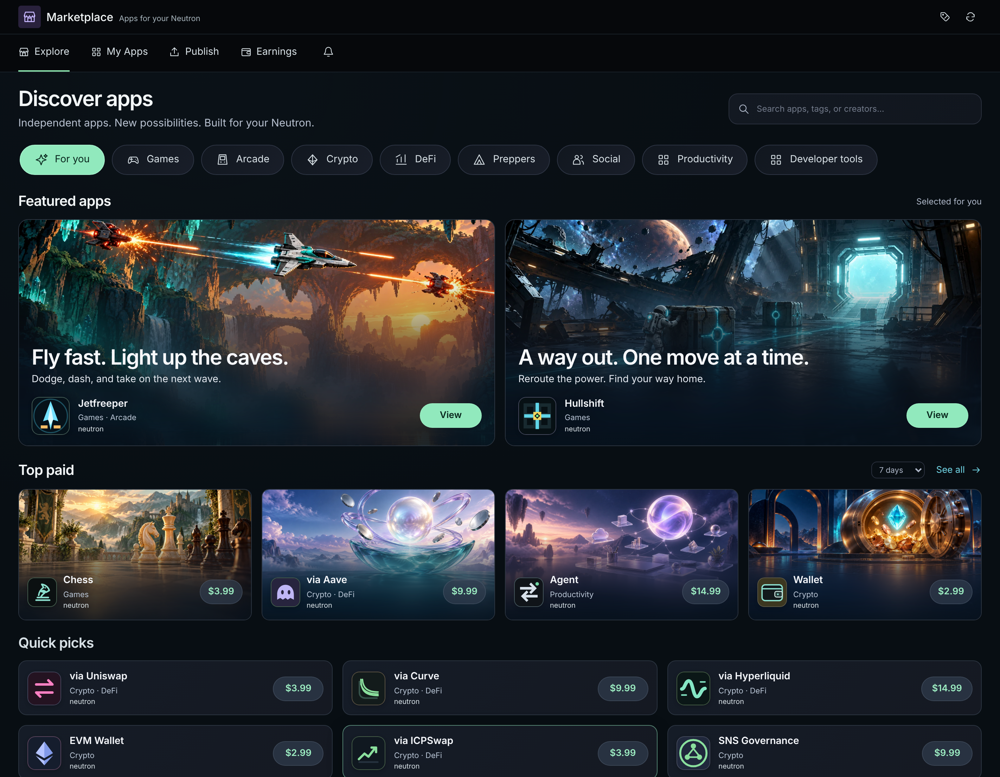

# Marketplace storefront review evidence

These Playwright screenshots render the actual Marketplace app inside its
iframe sandbox, at device pixel ratio 2, using the checked-in first-party cover
images and proposed editorial copy. Prices and acquisition counts are local
illustrative fixtures. They are not production prices, live catalog reads or
deployment evidence. External browser requests are blocked.

| Screenshot | Tile size | View |
|---|---|---|
| [Desktop](desktop.png) | 1422 × 1106 | Reference layout, two featured apps, four medium paid cards, six compact paid cards after paging |
| [Wide sidebar](sidebar.png) | 1800 × 1106 | Categories on the left |
| [Mobile](mobile.png) | 390 × 900 | Scrollable category row and stacked featured cards |
| [Free apps](free-apps.png) | 1422 × 1106 | Free chart with medium and compact cards |



Reproduce the screenshots and responsive/interaction assertions from the
repository root:

```sh
node apps/marketplace/test/browser/storefront.mjs
```

This also captures 320px and 960px widths under
`tmp/marketplace-storefront/screenshots/`. `CHROMIUM_PATH` can select the browser;
`MARKETPLACE_STOREFRONT_ARTIFACTS` can select the output directory. The
[browser results](browser-results.json) record layout, category/search, paging,
featured exclusion, CSS blur and JavaScript-error checks. The complete browser
suite also covers publishing, checkout, installation recovery, ratings and
publisher profile navigation.

## Release checks

Run on 2026-09-13:

- Complete `neutron-marketplace` workspace package and typecheck passed.
- App tests: 173 passed, 28 explicitly gated tests skipped; the backend Motoko
  program passed clean initialization, schema 1 migration and schema 2 restore.
- The separately enabled exact-archive PocketIC qualification passed both
  [release 112 / schema 1](upgrade-state1.json) and
  [release 118 / schema 2](upgrade-state2.json) upgrades to release 120 through
  the checked in-product installation transaction with unchanged Kernel 359.
  Both retain read identity/delegation, complete state and recovery journals;
  the schema-2 case also retains its saved discount. Each checks clean defaults.
- All nine app browser suites passed; storefront screenshots were refreshed
  after final source cleanup.
- App protocol integration passed against the real public Candid actor, including
  channel selection, exact release promotion/recovery, ratings/comments and
  selection-bound installation/purchases.
- Protocol unit tests: 170 passed. The initial runs hit the existing five-second
  timeout in media recovery tests. The successful run used
  `npm --workspace neutron-marketplace-protocol run test:unit -- --timeout 60000`
  with unchanged assertions.
- Protocol Ash tests: 130 succeeded, 1 skipped, 0 failed.
- Storefront host integration passed with an explicit predecessor build from
  PR base `00aa5a46036b90261837b9e76fbc155540486803`. It verifies stable type
  compatibility, populated keep-upgrade, retained ownership/releases/profiles,
  admin authorization/retries/conflicts, filtered pagination, stable/beta
  eligibility, certified cover access and restored storefront edits.

Protocol predecessor Wasm SHA-256:
`5742b989de18c7a653ed383b55ae2df78547f53452fb9de477dd22ab979fa0a2`.
The tested successor matches the complete workspace build:
`4cb57655e1131670d1eafaa522b13d74b9a59081708764f5680f753a1f4aa477`.
The PR-base predecessor is development evidence; qualify the actual deployed
predecessor before a production source upgrade.

The [package review](package-review.json) records the inspected archive and
matching offered-source sidecar. The app retains schema 2, its existing schema
1 migration and immutable lock lineage. No production deployment, catalog
publication, stable promotion, installed-app update or starter staging is
performed by these checks. Follow the
[storefront rollout](../../spec/storefront.md#memory-audit-and-release-order).

Reproduce that exact app qualification from the repository root:

```sh
NEUTRON_RUN_MARKETPLACE_DISCOUNT_UPGRADE=1 \
NEUTRON_MARKETPLACE_DISCOUNT_CANDIDATE_VERSION=120 \
NEUTRON_MARKETPLACE_DISCOUNT_CANDIDATE_SHA256=64bac460f9bdc687d4e26ebcf89c5e6b0ba24a6664bfff8feb53fac1bbc1a7a7 \
bun test apps/marketplace/test/discount_upgrade.pocketic.test.ts
```

Set `NEUTRON_POCKETIC_BIN` if the pinned local PocketIC executable is not found
automatically. For the protocol host case, provide the reviewed predecessor
Wasm with its sibling `.most` stable signature:

```sh
MARKETPLACE_STOREFRONT_PREVIOUS_WASM=/absolute/path/to/predecessor.wasm \
bun support/marketplace/scripts/test-integration.ts 'Storefront:'
```

## Artwork

Ten new 1672 × 941 WebP illustrations (about 2 MiB total) are saved under
[`catalog/media`](../../catalog/media), alongside the existing app icons and UI
screenshots. The [generation prompts](../../catalog/cover-prompts.json) retain
the exact prompts and built-in image-generation mode. The
[curation manifest](../../catalog/first-party-storefront.json) binds each cover
to its short copy and tags. CSS supplies the glass effect over the original
images; it is not baked into the artwork.
